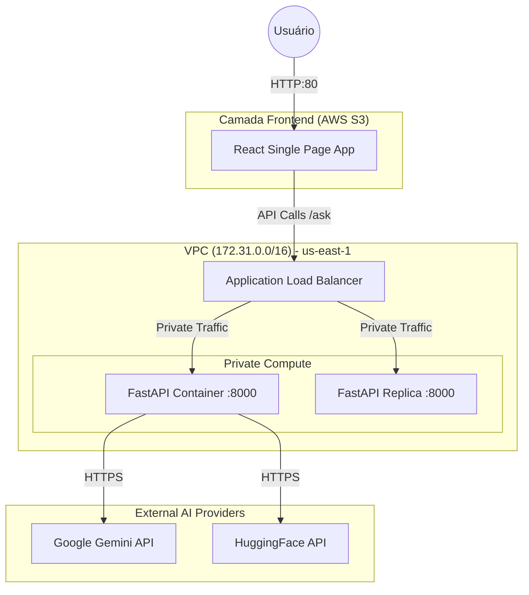
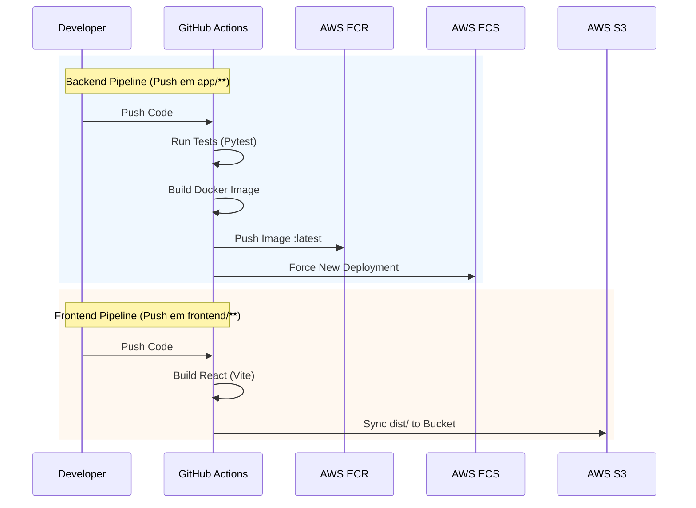

# ☁️ IsCoolGPT — Cloud Study Assistant


**IsCoolGPT** é uma plataforma de chat inteligente focada em auxiliar estudantes de Computação em Nuvem. O sistema utiliza uma arquitetura *Cloud Native* moderna na AWS, orquestrando múltiplos modelos de IA (Gemini, HuggingFace) para sintetizar respostas precisas e didáticas.

> **Nota de Arquitetura:** O projeto adota uma abordagem híbrida moderna: Backend conteinerizado em **AWS ECS Fargate** (Serverless Containers) e Frontend hospedado de forma estática no **AWS S3** (Static Website Hosting).

---

## 🏛️ Arquitetura e Infraestrutura

O projeto foi implantado na região **us-east-1 (Norte da Virgínia)** utilizando uma VPC padrão (CIDR `172.31.0.0/16`). A arquitetura segue o padrão de **Proxy Reverso** para segurança, onde o backend nunca é exposto diretamente à internet pública.

### Fluxo de Rede
1.  **Internet Gateway:** Recebe tráfego externo.
2.  **Application Load Balancer (ALB):** Ponto único de entrada (Porta 80).
3.  **ECS Fargate:** Containers privados (Porta 8000), acessíveis apenas via ALB.



🔒 Segurança de Rede (Security Groups)  
A infraestrutura implementa o princípio do privilégio mínimo utilizando Security Groups encadeados:

Componente | Security Group | Regra de Entrada (Inbound) | Descrição
--- | ---: | --- | ---
Load Balancer | iscoolgpt-alb-sg | TCP 80 (0.0.0.0/0) | Permite acesso HTTP público de qualquer lugar.
Aplicação | iscoolgpt-sg | TCP 8000 (Source: iscoolgpt-alb-sg) | Apenas aceita tráfego vindo do Load Balancer. Bloqueia acesso direto da internet.
VPC Default | default | Padrão | Configuração base da rede VPC.

---

🔁 Pipeline de CI/CD

O projeto utiliza GitHub Actions para entrega contínua. Existem dois pipelines distintos que rodam em paralelo, otimizando o tempo de deploy.



---

🧰 Stack Tecnológico

Camada | Tecnologia | Motivação da Escolha
--- | --- | ---
Backend | Python 3.12, FastAPI | Alta performance assíncrona para chamadas concorrentes de IA.
Frontend | React, Vite, Tailwind | Desenvolvimento ágil, SPA moderno e build otimizado.
Container | Docker | Padronização do ambiente de execução (Dev vs Prod).
Orquestração | AWS ECS Fargate | Gerenciamento serverless de containers (sem necessidade de gerenciar instâncias EC2).
Rede | AWS ALB & VPC | Distribuição de carga e isolamento de rede.
Armazenamento | AWS ECR & S3 | Repositório de imagens seguro e hospedagem estática de baixo custo.

---

## 🚀 Como Executar Localmente

### Pré-requisitos
- Python 3.12+
- Node.js 18+
- Docker & Docker Compose
- Conta AWS (apenas se for realizar deploy)

### 1. Backend (API)
```bash
# Clone o repositório
git clone https://github.com/seu-usuario/iscoolgpt-backend.git
cd iscoolgpt-backend

# Configurar ambiente virtual
python -m venv .venv
# Windows: .venv\Scripts\activate
# Linux/Mac: source .venv/bin/activate

# Instalar dependências
pip install -r requirements.txt

# Configurar variáveis (.env)
cp .env.example .env
# Adicione suas chaves: GEMINI_API_KEY, HUGGINGFACE_API_KEY

# Rodar servidor
uvicorn app.main:app --reload
```

A API estará disponível em: http://localhost:8000/docs

### 2. Frontend (Interface)
```bash
cd frontend

# Instalar dependências
npm install

# Configurar API
# Crie um arquivo .env.local na pasta frontend com:
# VITE_API_URL="http://localhost:8000"

# Rodar
npm run dev
```

O site estará disponível em: http://localhost:5173

---

🔐 Variáveis de Ambiente e Segredos

Para o funcionamento correto (Local ou GitHub Actions), as seguintes variáveis são necessárias:

Credenciais de Aplicação (Runtime)
- GEMINI_API_KEY: Acesso ao Google AI Studio.
- HUGGINGFACE_API_KEY: Acesso aos modelos Open Source.

Credenciais de Infraestrutura (GitHub Secrets)
- AWS_ACCESS_KEY_ID & AWS_SECRET_ACCESS_KEY: Permissões IAM (ECR, ECS, S3).
- AWS_REGION: us-east-1
- ECR_REPOSITORY: Nome do repositório no ECR.
- ECS_CLUSTER & ECS_SERVICE: Nomes configurados no ECS Fargate.
- AWS_S3_BUCKET: Nome do bucket público do frontend.
- VITE_API_URL: URL do Load Balancer (injetada no build do frontend).

---

🚧 Decisões de Projeto & Limitações

Para fins acadêmicos e simplificação de escopo, algumas decisões foram tomadas:

- HTTPS/SSL:  
  O frontend é servido via S3 Website Hosting (HTTP).  
  O backend é acessado via ALB (HTTP) na porta 80.  
  Solução ideal em produção: Adicionar AWS CloudFront (CDN) na frente do S3 e do ALB, utilizando certificados AWS ACM para criptografia ponta a ponta (SSL/TLS).

- CORS (Cross-Origin Resource Sharing):  
  O Backend está configurado para aceitar requisições vindas do domínio do S3 e de localhost para facilitar o desenvolvimento.

- Persistência:  
  A aplicação é stateless (não salva histórico). Para persistência, seria necessária a integração com AWS DynamoDB ou RDS.

---

👨‍💻 Autor

Vinicius  
Projeto desenvolvido para a disciplina de Cloud Computing (2025).